I thought I'd have a play with AWS's latest offering "OpsWorks", and see if they've done us all out of a job. Well, kinda.

OpsWorks is interesting. It's basically hosted chef, with EC2 integration. The immediate "drawbacks" to some are that there's only two supported distributions, Ubuntu 12.04 LTS and Amazon Linux. It's also incredibly rough around the edges.

It's easy to sign up to, and it adds a service to the AWS management console.


The first thing to do is to add a Stack.

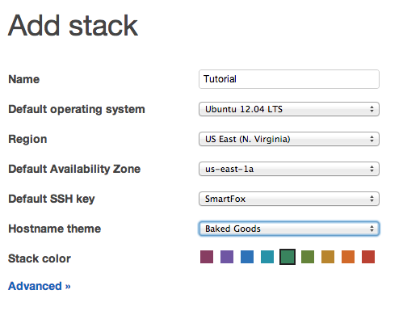

The Advanced options hide the ability to use custom chef cookbooks, and a blob of custom JSON for chef:


A stack is formed of Layers, which represent services.


I'm going to create a simple Rails app for my first layer:

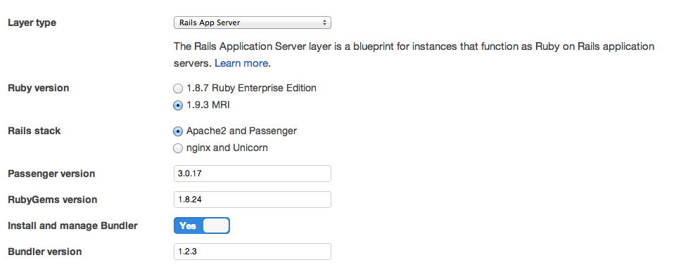

These are the default template options for layers:


This is what you see if you select MySQL Database Layer:

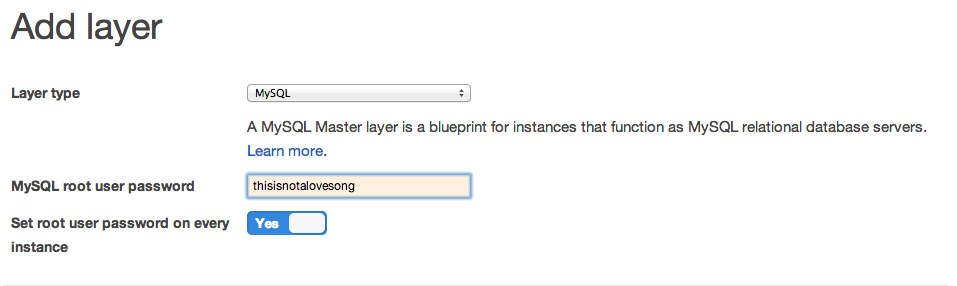

Next step is to configure and Instance of your layers.


Most irritatingly, there's no option to use Micro instances for your instances. Which kinda defeats the ability to use OpsWorks within the free tier usage package.

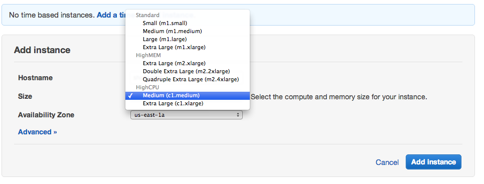

I chose a Time-based instance, you then get this thing:

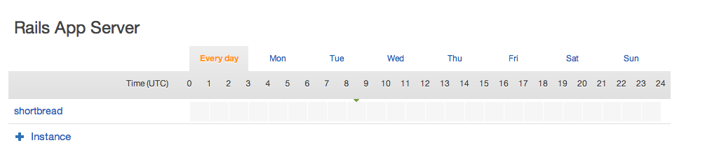

Which confused me for a while, because if you try and boot it now, you get stuck in a boot-loop, it'll boot, launch and terminate ad infinitum.

That's because that grey bar thing is clickable so you can set the times you want it to be available.


We can now define an Application to deploy:


I created a new git repository to use, and ran `rails new shortbread-beastie` in there.

https://github.com/tomoconnor/shortbread-beastie

There's a few different Deployment options, Git, SVN, S3 bundle and HTTP bundle, and "Other" - I have no idea what Other does, or is used for, unless there's an option to specify your deploy script somewhere.


Back to the Instances view, and this is quite shiny.


The next step is to create a Deployment, once you've got a running instance:

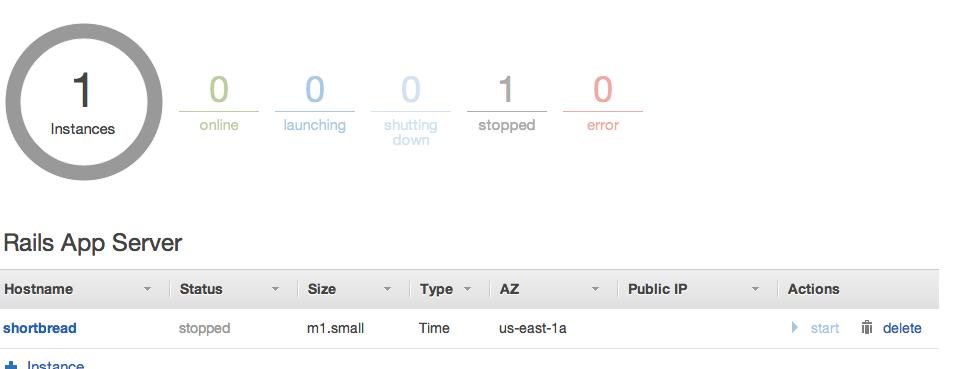

This is, however where the problems start. To deploy, you need a running instance.

So, I set some time for the instance availability, and hit launch. Then it failed.


So I terminated it, but it didn't die. It just booted another one.


Most irritating. I can't terminate it, because it goes "boot, stop, terminate" - and then repeats itself. I can delete the app, but can I delete the instance? Apparently not, because it's not stopped. It's forever booting.

Can I delete the Layer? Nope.


I also can't delete the stack.


So, what I have is a broken OpsWorks Stack, Instance and Layer configuration. Just by using the defaults. They weren't kidding when they said it was Beta. Interestingly, all the Chef Cookbooks are open-source on Github: https://github.com/aws/opsworks-cookbooks

Sneakily hidden away under the Layer configuration for the Rails Server layer, is this little lot of wonders. Those Chef Cookbook definitions are github links :D

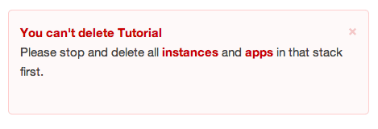

You can also configure it to add other OS packages, mount EBS volumes and so on.

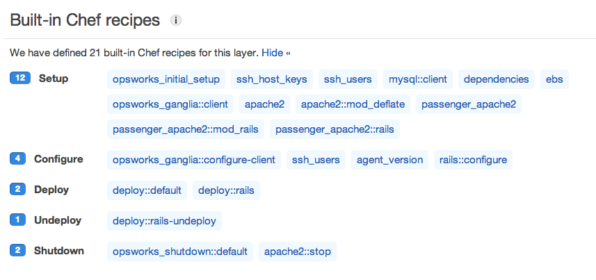

And set the Security Groups if different from the original defaults.

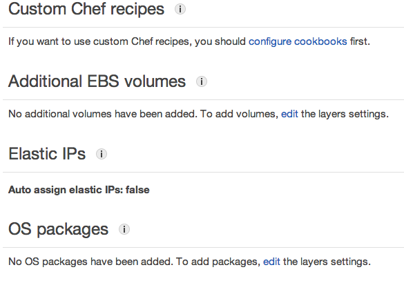

I created a support request on the AWS Forums, and in under an hour, had an AWS engineer looking at it. I can't wait to see what they find. https://forums.aws.amazon.com/thread.jspa?threadID=117185&tstart=0

## PART 2


I had planned to have another go from scratch as soon as the AWS team cleared the broken instance out. After I'd noticed they'd wiped out the instances from my OpsWorks account. I wasn't entirely sure what'd caused the first one to break in such a catastrophic fashion, but I just built another one from defaults. This is how that unfolded.

New Instance time!

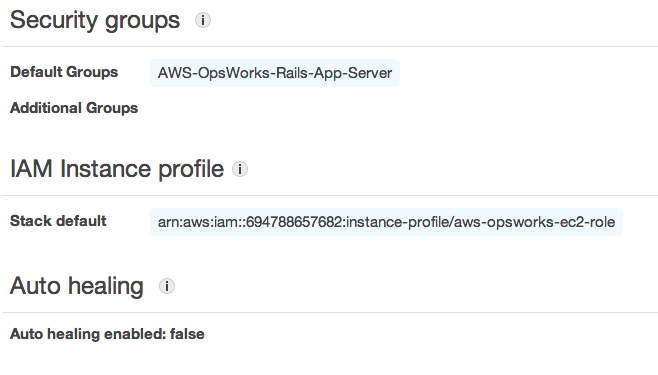

Well, that bit worked, we should have a go at starting it, really

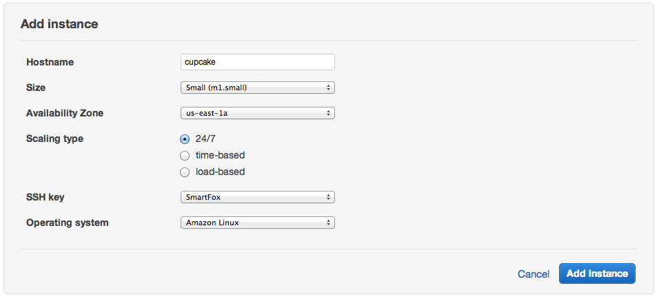

The setup process took about 10 minutes, before failing, albeit slightly less catastrophicaly than last time.

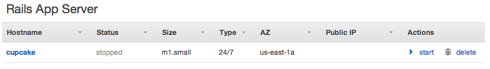

Interestingly, this time it had failed, it was at least running. I had a quick look for the log files generated, but got this message:


However! After I ssh'd in, I had a look in the usual places for something log-worthy.
```
		/var/log/cloud-init.log
		/var/log/aws/opsworks/
		installer.log       opsworks-agent.log  user-data.log
```

None of which contained any errors. I had a look through /var/log/secure to see what it was doing, and found the location of the chef files/JSON/logfiles, and found this:

`/var/lib/aws/opsworks/chef/2013-02-19-16-00-48-01.log` 

Which contained the following interesting nuggets
```
[Tue, 19 Feb 2013 16:09:08 +0000] DEBUG: ---- Begin output of grep '/^StrictHostKeyChecking no$/' /home/deploy/.ssh/config ----
[Tue, 19 Feb 2013 16:09:08 +0000] DEBUG: STDOUT: 
[Tue, 19 Feb 2013 16:09:08 +0000] DEBUG: STDERR: 
[Tue, 19 Feb 2013 16:09:08 +0000] DEBUG: ---- End output of grep '/^StrictHostKeyChecking no$/' /home/deploy/.ssh/config ----
[Tue, 19 Feb 2013 16:09:08 +0000] DEBUG: Ran grep '/^StrictHostKeyChecking no$/' /home/deploy/.ssh/config returned 1
[Tue, 19 Feb 2013 16:09:08 +0000] DEBUG: Executing echo 'StrictHostKeyChecking no' > /home/deploy/.ssh/config
[Tue, 19 Feb 2013 16:09:08 +0000] DEBUG: ---- Begin output of echo 'StrictHostKeyChecking no' > /home/deploy/.ssh/config ----
[Tue, 19 Feb 2013 16:09:08 +0000] DEBUG: STDOUT: 
[Tue, 19 Feb 2013 16:09:08 +0000] DEBUG: STDERR: 
[Tue, 19 Feb 2013 16:09:08 +0000] DEBUG: ---- End output of echo 'StrictHostKeyChecking no' > /home/deploy/.ssh/config ----
[Tue, 19 Feb 2013 16:09:08 +0000] DEBUG: Ran echo 'StrictHostKeyChecking no' > /home/deploy/.ssh/config returned 0
[Tue, 19 Feb 2013 16:09:08 +0000] INFO: Ran execute[echo 'StrictHostKeyChecking no' > /home/deploy/.ssh/config] successfully
[Tue, 19 Feb 2013 16:09:08 +0000] DEBUG: Processing template[/home/deploy/.ssh/id_dsa] on cupcake.localdomain
[Tue, 19 Feb 2013 16:09:08 +0000] DEBUG: Skipping template[/home/deploy/.ssh/id_dsa] due to not_if
[Tue, 19 Feb 2013 16:09:08 +0000] DEBUG: Processing directory[/srv/www/shortbread_beastie/shared/cached-copy] on cupcake.localdomain
[Tue, 19 Feb 2013 16:09:08 +0000] DEBUG: Processing ruby_block[change HOME to /home/deploy for source checkout] on cupcake.localdomain
[Tue, 19 Feb 2013 16:09:08 +0000] DEBUG: Processing deploy[/srv/www/shortbread_beastie] on cupcake.localdomain
[Tue, 19 Feb 2013 16:09:08 +0000] INFO: deploying branch: HEAD
[Tue, 19 Feb 2013 16:09:08 +0000] INFO: ensuring proper ownership
[Tue, 19 Feb 2013 16:09:08 +0000] INFO: updating the cached checkout
Tue, 19 Feb 2013 16:09:08 +0000] INFO: Cloning repo git@github.com:tomoconnor/shortbread-beastie.git to /srv/www/shortbread_beastie/shar
ed/cached-copy
[Tue, 19 Feb 2013 16:09:08 +0000] DEBUG: Executing git clone --depth 5 git@github.com:tomoconnor/shortbread-beastie.git /srv/www/shortbre
ad_beastie/shared/cached-copy
[Tue, 19 Feb 2013 16:09:09 +0000] DEBUG: ---- Begin output of git clone --depth 5 git@github.com:tomoconnor/shortbread-beastie.git /srv/w
ww/shortbread_beastie/shared/cached-copy ----
[Tue, 19 Feb 2013 16:09:09 +0000] DEBUG: STDOUT: Cloning into /srv/www/shortbread_beastie/shared/cached-copy...
[Tue, 19 Feb 2013 16:09:09 +0000] DEBUG: STDERR: Warning: Permanently added 'github.com,207.97.227.239' (RSA) to the list of known hosts.
Permission denied (publickey).
fatal: The remote end hung up unexpectedly
[Tue, 19 Feb 2013 16:09:09 +0000] DEBUG: ---- End output of git clone --depth 5 git@github.com:tomoconnor/shortbread-beastie.git /srv/www/shortbread_beastie/shared/cached-copy ----
[Tue, 19 Feb 2013 16:09:09 +0000] DEBUG: Ran git clone --depth 5 git@github.com:tomoconnor/shortbread-beastie.git /srv/www/shortbread_beastie/shared/cached-copy returned 128
[Tue, 19 Feb 2013 16:09:09 +0000] ERROR: deploy[/srv/www/shortbread_beastie] (/opt/aws/opsworks/releases/20130218135253_103/cookbooks/deploy/definitions/opsworks_deploy.rb:60:in `from_file') had an error:
git clone --depth 5 git@github.com:tomoconnor/shortbread-beastie.git /srv/www/shortbread_beastie/shared/cached-copy returned 128, expected 0
---- Begin output of git clone --depth 5 git@github.com:tomoconnor/shortbread-beastie.git /srv/www/shortbread_beastie/shared/cached-copy ----
STDOUT: Cloning into /srv/www/shortbread_beastie/shared/cached-copy...STDERR: Warning: Permanently added 'github.com,207.97.227.239' (RSA) to the list of known hosts.
Permission denied (publickey).
fatal: The remote end hung up unexpectedly
```

Could it be? Has the github deploy ssh key problem hit the almighty AWS too? Looks like it. A good question however, is why on earth does the precursor,

`execute[echo 'StrictHostKeyChecking no' > /home/deploy/.ssh/config]`

which was completed sucessfully, not prevent this from happening?

 

So, I changed the app git repository from a git@github SSH style one to a git://github.com/tomoconnor/shortbread-beastie.git, which shouldn't need to add a SSH key to the known_hosts file. In 10 - 15 minutes, it should have re-run setup, and all that, and we should have either a working instance, or another failure.

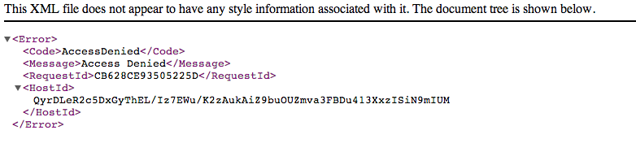


Bugger me. It worked.

Here's a screengrab of it running in chrome live on the EC2 cloud. I actually killed it off a few minutes ago, as it's costing me money.

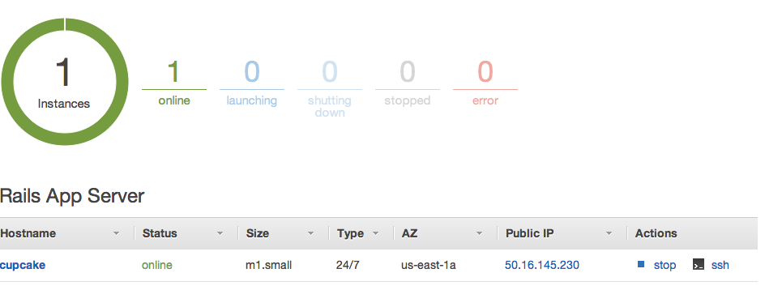

Looks so far like the big bugs concern the SSH Host Key acceptance thing that I found, and the fact that if you disturb the running EC2 instances from the EC2 control panel (which I accidentally did), then the OpsWorks side loses touch with the EC2 side, and the whole thing goes into that boot-stop-terminate-boot loop.