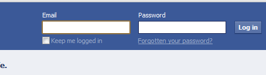
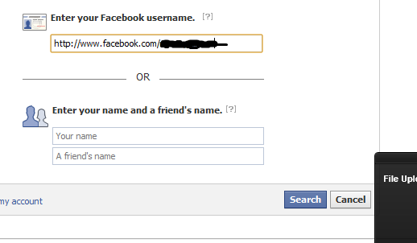

To prove a point about the latest "Pornstar Name" Meme that's currently going around Twitter.  Basically, the meme asks for you to tweet your Pornstar name which is comprised of the name of your first pet, and your mother's maiden name. 

I'm furious about this.  Those two names are the two most common answers to security questions found on a number of websites.

So.  A theory: "Given just a user's facebook name, and their Pornstar name, it should be possible to compromise their facebook account".

**I did this test with the full permission of the real account holder.  I do not condone the use of this information for nefarious or illegal purposes, it is presented for educational use only.**

Proof:

Open facebook, and click the "Forgot Password" link.

1) Identify the target account:

2) Confirm the account, but click "No longer have access to these"

3) Provide a new email address:

4) Go check that email account for further details on how to proceed.

4b) There is a missing step here.  I forgot to screencap the bit where it asks your secret question, which may or may not be one of the ones referred to in the Meme, but I bet it is.  Mother's maiden name and the names of pets are the most common questions.

5) You can then create a new password :O (For an account you don't own. .. Yeah, it's pretty bad, this, isn't it?)

6) There is, however a problem.  Facebook by default will lock the account for 24 hours.  This does however protect the user, as it sends them a load of emails to their other email accounts, basically saying "OH SHIT, WHAT ARE YOU DOING?!!"

## IMPORTANT:

I'm presenting this information as proof of the theory that the Pornstar Name meme is damaging, and provides enough information to compromise an account.  

**Again, I did this test with the full permission of the real account holder.  I do not condone the use of this information for nefarious or illegal purposes, it is presented for educational use only.**

Update:
-------
This exploit is no longer possible due to changes in the account recovery process.  Just as well, really.

