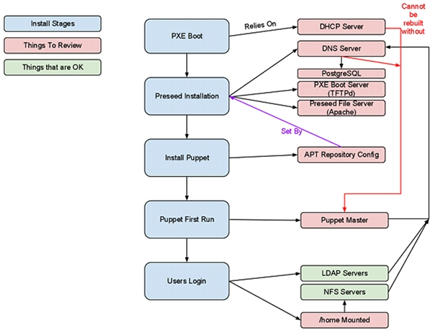

Right.  Let’s have a look at the massive technical implications of the Fix Puppet idea. 

As I mentioned in my earlier blogpost, in order to fix puppet in a sensible way, we’ll have to review all, and overhaul some of the underlying infrastructure that allows it all to run.

The interlinks and dependencies between all the parts are a little tricky to visualise.  So, here’s a picture.




Anything in red needs attention, and the stuff in green *just works*.  Things in blue are install stages, and these are what we’re working on making perfect.

Right, so we’ve basically got a directed graph, representing the steps and stages that have to happen to a new machine before users can log in. 

The steps taken to build a machine, roughly look like this:

1. Unbox.
1. Plug in.
1. Configure Netboot.
1. Hand MAC Address to DHCP server and assign a hostname.
1. Client PXEBoots.
1. Client downloads a preseed file.
1. Client installs itself.
1. Client Reboots.
1. Puppet runs on First Boot.
1. Puppet completes.
1. Client Reboots again.
1. Users login
 

That’s about it, really. The first 4 steps are a hell of a lot easier with the support and co-operation of the supplier.  It’s nice to have systems preconfigured to PXE boot as the BIOS default, and even cooler if they can send the MAC addresses as labels on each physical machine.

If we’re going to build out a new infrastructure, we’re going to need to review and reinstall the servers that provide this infrastructure, before we can build any workstations.

I’m a massive massive fan of puppet, and believe that it should be used for the configuration of all servers and workstations.  As such, I didn’t want to rebuild anything without using puppet, so the first step, had to be getting puppet working again.

**So, without further ado, let’s take a look at the Puppet portion of this, well, one of them.**

My predecessor saw fit that all nodes should be defined with puppet-dashboard, which is itself, a fine piece of software, but I think more for reporting than specification.  

Initially, at least, I rebuilt the puppet manifest from a known-good configuration.  Namely the base configs I wrote for a blogpost about a year ago; base configs that I’m going to update soon.

I’m a bit of an old fashioned puppet user.  I like my nodes defined in nodes.pp, not some External Node Classifier service.  
Reason being, I like to be able to look in one place and find exactly what I want.  It’s not a massive ballache to clone down the puppet git repo, make a change and push it back up.

In fact, it’s better than having a web interface for your node classifications, because git provides you with an intrinsic log of what was changed, and it’s easy to revert to an old version, because everything’s stored in source control.  

You can also test what you’re about to do, because again, it’s just a source control repo.  I’m a fan of having Jenkins run a few sanity checks on your puppet repo, but that’s a digression for another blogpost.

I’m not going to go into great depth about how to install DHCP and DNS, and how to make it work with puppet, at least, not here.  

What I will say, though is that [Puppet Module Tool](https://github.com/puppetlabs/puppet-module-tool) is the most fantastically easy way to generate boilerplate modules for puppet.

All you need to do is run

`puppet-module generate tomoconnor-dhcp`

and you get a full puppet module folder called tomoconnor-dhcp which contains all the structure according to the best practice guidelines.

 

Excellent.

As part of the review process, it became quite apparent that **Bind9** has no sensible admin/management interface, or at least, there wasn’t one installed, and frankly, anything that has such horrific config files should be shot.

Having had good experience and results using **PowerDNS** in the past, we decided that this would be a valid upgrade from BIND.
PowerDNS relies on a SQL backend for storing the record data in.  

You can use either MySQL or PostgreSQL, or possibly some others.  Since MySQL can be a bitch, and is, to all serious purposes, a toy database, Postgres seems like a better choice.  9.1 is stable, and there are  deb package available for it.  9.1 also does hot-standby replication, which is a miracle, because Postgres replication used to be a massive pain in the testicles.

There were, initially some mysterious problems with the TFTPd server being generally crappy, mostly regarding timeouts, which was because the storage of the TFTP data was on a painfully slow disk.  Moving it from there to the NFS mount dramatically increased performance and stopped TFTP going crazy.

In the TFTP'd config, there's a block for configuring the boot options of the preseed install.  This is how PXE hands over the details of the preseed server, and the classes of preseed file to run (basically, which modules)
```
label lucid_ws
        menu label ^2) Auto Install Ubuntu Lucid WorkStation
        text help
        Start hands off install of a workstation.
        endtext
        menu default
        kernel ubuntu-1004-installer/amd64/linux
        append tasks=standard pkgsel/language-pack-patterns= pkgsel/install-language-support=false vga=normal initrd=ubuntu-1004-installer/amd64/initrd.gz -- quiet auto debian-installer/country=GB debian-installer/language=en debian-installer/keymap=us debian-installer/locale=en_GB.UTF8 netcfg/choose_interface=eth0 netcfg/get_hostname=ubuntu netcfg/get_domain=installdomain.wibblesplat.com url=http://autoserver/d-i/lucid/preseed.cfg classes=wibblesplat;workstation DEBCONF_DEBUG=1
```

Initially, the Preseed files contained all sorts of crazy hacky shit in the `d-i late-command` setting.  


`late-command` is cool.  It’s basically the last thing to run before the first reboot when you build a new debian/ubuntu system.  You can tell it to do all sorts of stuff in there.  You probably shouldn’t, though.  Especially when what you’re doing in there is better done elsewhere.

The previous Preseed file contained a whole bunch of “inject these source files into /etc/apt/sources.list”, which is utter bullshit, because you can do exactly the same thing with d-i local repositories, which does the same thing, only far far cleaner.

That’s not to say that my refactored preseed files don’t use late-command at all.

I’ve chosen to insert some lines into `/etc/rc.local` on the freshly built system that ensures a puppet run at first boot. 

On the preseed server, there’s a file called `firstboot.sh` which gets dropped into `/usr/local/bin` by way of a wget command in `late-command`. 

The next thing that happens in late-command is a line to remove “exit 0” from /etc/rc.local and replace it with a thing that calls `/usr/local/bin/firstboot.sh`

When firstboot runs, it runs puppet, checks for sanity, and then removes itself from /etc/rc.local.

The code to actually do that looks like this:

```
d-i preseed/late_command string  \
wget -q -O /target/root/firstboot.sh http://autoserver/d-i/bin/firstboot.sh && \
chmod +x /target/root/firstboot.sh && \
sed -i 's_exit 0_sh /root/firstboot.sh_' /target/etc/rc.local
```

This relies on having something on hxxp://autoserver that is basically just apache hosting some files for the preseeder to retrieve during installation.

Cool huh? 

That ensures that the first thing that happens once the new machine has been built and rebooted, is a puppet run.

Some stuff we do here relies on our hand-rolled deb packages, which are stored in our own, internal APT repo.  We’ve also got an APT cache, created and maintained by apt-cacher-ng, which at least means that when you’re rebuilding systems frequently, that all the packages you would otherwise download from archive.ubuntu.com come straight over the LAN.  

The major problem initially with this was the speed, or lack of.  It certainly wasn’t performing anywhere near speeds you’d expect from a 1GE LAN, and the reason was again, slow disks. Moving the apt-cache files to the NFS highspeed storage again helped performance.  If we struggle in future, I’m going to look at a SSD cache for this, but I think that the performance of the SAS/SATA disks on massively parallel storage provided by our NFS servers will be adequate for the forseeable future.

Next up, the Puppetmaster.  Again, I was pretty keen on building this from scratch, but using puppet itself to configure it’s own master.  Sounds pretty counter-intuitive, right? But the puppet client can bootstrap the master quite easily by using files as it’s source.  

The first step is to clone down the latest puppet manifests from git, so you either need to git export elsewhere, or install git-core.  Your choice.

Once you’ve got those, all you need to do is install puppet-client, and run:

` puppet apply /path/to/your/manifests/site.pp`

If you’ve written the manifests right, and you’ve got your master defined as a node, you should find that puppet will install puppetmaster, and so on, and then you get a ready and working puppetmaster that just configured itself.

I used puppet-module tool to generate modules for the following services/items: “applications” - which actually contains a bunch of custom/proprietary application install rules, a declassified example is there’s a googlechrome.pp file that installs chrome from a PPA.

Other modules: dhcp, kernel, ldap, network, nfs, nscd, ntp, nvidia, postgres, powerdns and ssmtp.

As is the trend with puppet, and modern DevOps, a vast majority of the code in the entire manifest repository has been gleaned and researched from other puppet modules on github. Acknowledgement is in place where it’s due, and the working copies we’re using are frequently forked on github from the original.

It’s great, this, actually.  If you search on PuppetForge http://forge.puppetlabs.com/ the array of modules available is staggering.  It makes bootstrapping a new manifest set remarkably quick and easy.

The NFS module contains a bunch of requirements for mounting NFS shares, and the definitions for an NFS share to be mounted.  All pretty simple stuff, but modularised for ease of use.

I’m particularly proud of the postgres module which has a master class, and a slave class, which installs and configures the required files and packages to enable streaming hot-standby replication on Postgres9.1

I will release the declassified fork of this soon.

I’m going to wrap this post up here.  It’s a massively long one, and there’s still lots more left to write.  

 