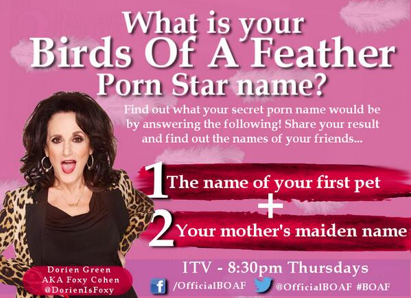

(If you've just read this for the first time today, you should read all of it.)

The first meme we'll discuss is the "Royal Wedding Name".  

BOHICA. 

Again, It seems that some of you aren't understanding how these things work.  The Royal Wedding Name asks for 

* Your grandparent's name (first name, male or female)
* Your first pet's name
* The name of the street you grew up on.

Right, you lot. Stop this now.   

I hate these name game memes, because as you should remember from last time, they're a crafted attack to reveal bits of information about you.   Remember what I did to someone's facebook profile based on this info?

This one's been going on for a lot longer than I thought.. And a lot of you will be using your real grandparents' names, and the real names of your pets, and the real streets you've lived on.  That's just silly.  And dangerous.
And it's your fault if you get your identity stolen because of that. 

### OTHER SIMILAR MEMES:
January 7th 2014:

"The Birds of a Feather Porn Star Name Game" - spotted on twitter, [tweeted by an official twitter stream for a new ITV show](https://twitter.com/OfficialBOAF/status/420521015874035712).

I am, unsurprisingly, **furious**.  I've attempted to contact the twitter feed owner, to get them to pull these tweets off their stream.

We've seen it from people who start memes, but this is the first time I've seen it with commercial sponsorship.  It's not big, and it's not clever.  **Stoppit**. 

### November 14th 2013

The "Elf Name" meme.

First spotted on Facebook, seems to be spreading both on Facebook and Twitter as #myELFname. 

This one asks for the first letter of your first name (nothing too telling here), and the month you were born in (slightly more PII [Personally Identifiable Information ).  

Android screenshot 

 

There's nothing special about this one, it's only asking for minimal PII, but still.  It's a slippery slope, and these memes are *still* occurring.

October 23rd 2013

"Your Downton Name"

Comprised of your Grandparent's First Name, and your First School.

Both of these are known questions for a number of secret answer challenges. 

February 7th 2013

"The Corgi Name"

Comprised of your Zodiac sign, Favourite colour, and last digit of your telephone number.  Apparently this is what passes for amusement these days.  

This one was heavily promoted by @BuzzFeed and gained 100+ retweets.  They really should know better.

March 4th 2011
The current meme is the "Pornstar Name"

This meme is asking for your First Pet, and your Mother's Maiden Name. 

 

Earlier Occurances

The NPR Name Game:

Comprised of your Grandparent's Middle Name, and your first Foreign Penpal's Last Name.

Seriously, These are some of the most common security questions used on a very large number of websites.  By publicly tweeting the answer, you are handing over all the details a nefarious hacker needs to compromise your account, and steal your identity.

I cannot stress this highly enough.  Do NOT tweet your Porn Name / Pornstar Name, or any other of these Name Game memes.

There’s  often a meme going around on facebook/twitter/etc.. One of these note things, you do it, you tag your friends, they do it, and so on, or it proliferates on twitter.

These bug me enormously, because they ask for a fair bit of information.  Here’s a brief summary of the answers you give.

 

Your Full Name
Your Mother’s Middle Name.
Your Grandfather’s Name.
Your favourite: Colour, Animal, Drink, Ice cream flavour, Cookie
Place of Birth
Street where you live
Street you grew up on
Name of your Pet
 

I recognise some of those as secret question/answer pairs from a number of websites.  

I’m really only kicking the tyres on this one, but what if someone designed these memes to gather data about people, including data about their past, place of birth, residential address, pet names, other stuff that’s commonly asked for sample questions on “Secret Question/Answer” credentials online.

I decided not to participate in this one unsurprisingly.  In fact, I recommend that everyone who has done the “Name Game” note looks closely at their note privacy settings, just to make sure they don’t mind everyone knowing this information about them.