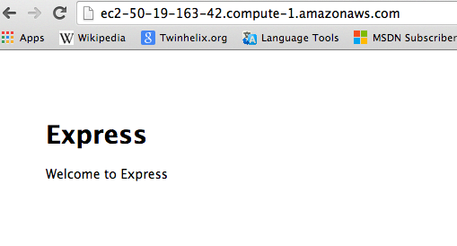

## This no longer represents good practices. 
## Use Terraform for deploying resources to AWS instead of Ansible.

By this point, you should have read Part 1: Getting Started with Ansible, and Part 2: Deploying Applications with Ansible.  

If you haven't, go and do it now.

You should also be familar with some of the basic concept surrounding AWS deployment, how AWS works, and so on. 

So, you'll have some idea how Ansible uses playbooks to control deployment to target hosts, and some idea of the capability for deploying code from version control systems (in Part 2, we used the Ansible git: module.).

In this section, we'll be looking at how you can put it all together, using Ansible to provision an EC2 instance, do the basic OS config, and deploy an application.

In previous parts, we've only needed to have the Ansible python module installed on the execution host (y'know, the one on which you run ansible-playbook and so on).  When we're dealing with Amazon Web Services (or Eucalyptus), we need to install one extra module, called 'boto', which is the AWS library for python.

You can do this either from native OS packages, with 

`sudo apt-get install python boto` 
(on Ubuntu)

`sudo yum install python-boto `
(on RHEL, Centos, Fedora et al.)

or from pip:

`pip install boto`
Interesting side note.. I had to do this globally, as even inside a virtualenv, ansible-playbook reported the following error:
```
  failed: [localhost] => {"failed": true}
  msg: boto required for this module
  FATAL: all hosts have already failed -- aborting
```

I think we'll create a separate playbook for this, for reasons which should become apparent as we progress.

From your `parallax` directory, create a branch, and a new subdirectory under `playbooks/`

I'm calling it `part3_ec2`, but you'll probably want to give your playbook and branch a more logical name.

I'm going to go ahead and create a totally different hosts inventory file, this time only including four lines:

```ini
[local]
localhost
[launched]
```

The reason for this, is because a lot of the configuration, provisioning EC2 hosts etc actually happens from the local machine that you're running ansible-playbook on.

The site.yml in this playbook will have a different format.  For this first attempt, I'm not sure if I can see any real value in breaking the provisioning up into separate roles.  I might change that in future, if we decide to configure Elastic LoadBalancers and so on.

 

AWS and IAM
---------------

Amazon Web Services now provide a federated account management system called IAM (Identity and Access Management). Traditionally, with AWS, you could only create two pairs of Access/Secret keys.

With IAM, you can create groups of users, with role-based access control capabilities, which give you far more granular control over what happens with new access/secret key pairs.

In this article, I'm going to create an IAM group, called "`deployment`"

From your AWS console, visit the IAM page:

https://console.aws.amazon.com/iam/home#home

Click the "Create a new group of users" button as shown

We'll call it "Deployment" 

We need to assign roles to the IAM group.  Power User Access seems reasonable for this.. Provides full access to AWS servies and resources, but does not allow user group modifications.

This is a JSON representation of the permissions configuration:


We'll create some users to add to this Deployment group:

Let's call one "ansible".
 

We should get an option now to download the user credentials for the user we just created. 

 ansible

```
Access Key ID:
AKHAHAHAFATCHANCELOLLHA
Secret Access Key:
rmmDoYouReallyThingImGoingTo+5ShareThatzW
```

If you click the "Download Credentials" button, it'll save a CSV file containg the Username, and the Access/Secret Key. 

-- 

Back to the main theme of this evening's symposium:

To avoid storing the AWS access and secret keys in the playbook, it's recommended that they be set as Environment Variables, namely: 

`AWS_ACCESS_KEY`

and

`AWS_SECRET_KEY`

Second to that, we'll need a keypair name for the new instance(s) we're creating.  I assume you're already familiar with the process of creating SSH keypairs on EC2.

I'm calling my keypair "`ansible_ec2`".  Seems logical enough.

I've moved this new keypair, "ansible_ec2.pem" into `~/.ssh/` and set its permissions to 600 (otherwise ssh throws a wobbly.)

We'll also need to pre-create a security group for these servers to sit in.  As you'll see in my site.yml, i've called this "sg_thingy".  I'm going to create this as a security group, allowing TCP ports 22, 80 and 443, and all ICMP traffic through the firewall.

If you haven't specified an existing keypair, or existing security group, ansible will fail and return an error.

I'm going to create a new site.yml file too, containing the following:

```yml

---
# Based heavily on the Ansible documentation on EC2:
http://docs.ansible.com/ec2_module.html
  - name: Provision an EC2 node
    hosts: local
    connection: local
    gather_facts: False
    tags: provisioning
    vars:
      instance_type: t1.micro
      security_group: sg_thingy
      image: ami-a73264ce
      region: us-east-1
      keypair: ansible_ec2
    tasks:
      - name: Launch new Instance
        local_action: ec2 instance_tags="Name=AnsibleTest" group={{ security_group }} instance_type={{ instance_type}} image={{ image }} wait=true region={{ region }} keypair={{ keypair }}
        register: ec2
      - name: Add instance to local host group
        local_action: lineinfile dest=hosts regexp="{{ item.public_dns_name }}" insertafter="[launched]" line="{{ item.public_dns_name }} ansible_ssh_private_key_file=~/.ssh/{{ keypair }}.pem"
        with_items: ec2.instances
        #"
      - name: Wait for SSH to come up
        local_action: wait_for host={{ item.public_dns_name }} port=22 delay=60 timeout=320 state=started
        with_items: ec2.instances
  - name: With the newly provisioned EC2 node configure that thing
    hosts: launched # This uses the hosts that we put into the in-memory hosts repository with the add_host module.
    sudo: yes # On EC2 nodes, this is automatically passwordless. 
    remote_user: ubuntu # This is the username for all ubuntu images, rather than root, or something weird.
    gather_facts: True  #We need to re-enable this, as we turned it off earlier.
    roles:
      - common
      - redis
      - nginx
      - zeromq
      - deploy_thingy
      # These are the same roles as we configured in the 'Parallax/example' playbook, except they've been linked into this one.
```

I've gone ahead and predefined a hostgroup in our hosts inventory file called '`[launched]`', because I'm going to insert the details of the launched instances into that with a local_action.

If it works, you should get something like this appearing in the hosts file after it's launched the instance:

```
[launched]
ec2-50-19-163-42.compute-1.amazonaws.com ansible_ssh_private_key_file=ansible_ec2.pem
```

I've added a tag to the play that builds an EC2 instance, so that you can run ansible-playbook a further time with the command-line argument --skip-tags provisioning so that you can do the post-provisioning config steps, without having to rebuild the whole VM from the ground up.

I've added some stuff to the common role, too, to allow us to detect (and skip bits) when it's running on an EC2 host.
```yml
  - name: Gather EC2 Facts
    action: ec2_facts
    ignore_errors: True
```
And a little further on, we use this when: selector to disable some functionality that isn't relevant on EC2 hosts.

`when: ansible_ec2_profile != "default-paravirtual"`
 

Running Ansible to Provision
============================

 

I'm running ansible-playbook as follows:

`AWS_ACCESS_KEY=AKHAHAHAFATCHANCELOLLHA AWS_SECRET_KEY="rmmDoYouReallyThingImGoingTo+5ShareThatzW" ansible-playbook -i hosts site.yml`

Because I've pre-configured the important information in site.yml, Ansible can now go off, using the EC2 API and create us a new EC2 virtual machine.

```
PLAY [Provision an EC2 node] **************************************************
TASK: [Launch new Instance] ***************************************************
changed: [localhost]
TASK: [Add instance to local host group] **************************************
ok: [localhost] => (item={u'ramdisk': None, u'kernel': u'aki-88aa75e1', u'root_device_name': u'/dev/sda1', u'placement': u'us-east-1a', u'private_dns_name': u'ip-10-73-193-26.ec2.internal', u'ami_launch_index': u'0', u'image_id': u'ami-a73264ce', u'dns_name': u'ec2-54-205-128-232.compute-1.amazonaws.com', u'launch_time': u'2014-01-28T22:33:50.000Z', u'id': u'i-414ec06f', u'public_ip': u'54.205.128.232', u'instance_type': u't1.micro', u'state': u'running', u'private_ip': u'10.73.193.26', u'key_name': u'ansible_ec2', u'public_dns_name': u'ec2-54-205-128-232.compute-1.amazonaws.com', u'root_device_type': u'ebs', u'state_code': 16, u'hypervisor': u'xen', u'virtualization_type': u'paravirtual', u'architecture': u'x86_64'})
TASK: [Wait for SSH to come up] ***********************************************
ok: [localhost] => (item={u'ramdisk': None, u'kernel': u'aki-88aa75e1', u'root_device_name': u'/dev/sda1', u'placement': u'us-east-1a', u'private_dns_name': u'ip-10-73-193-26.ec2.internal', u'ami_launch_index': u'0', u'image_id': u'ami-a73264ce', u'dns_name': u'ec2-54-205-128-232.compute-1.amazonaws.com', u'launch_time': u'2014-01-28T22:33:50.000Z', u'id': u'i-414ec06f', u'public_ip': u'54.205.128.232', u'instance_type': u't1.micro', u'state': u'running', u'private_ip': u'10.73.193.26', u'key_name': u'ansible_ec2', u'public_dns_name': u'ec2-54-205-128-232.compute-1.amazonaws.com', u'root_device_type': u'ebs', u'state_code': 16, u'hypervisor': u'xen', u'virtualization_type': u'paravirtual', u'architecture': u'x86_64'})
```

Cool.

Now what? 

Well, we'll want to configure this new instance *somehow*.  As we're already using Ansible, that seems like a pretty good way to do it. 

To prevent code reuse, I've symlinked the roles from the example playbook into the part3 playbook, so that I should theoretically be able to include them from here. 

Come to think of it, you should be able to merge the branches (you'll probably have to do this semi-manually), because it should be possible to have the two different play types coexisting, due to the idempotent nature of Ansible.

I've decided not to merge my playbooks into one directory, because for the time being, i want to keep site.yml separate between the EC2 side and the non-EC2 side.

As I mentioned earlier, I added a tag to the instance provisioning play in the site.yml file for this playbook.  This means that now I've built an instance (and it's been added to the hosts inventory (go check!)), I can run the configuration plays, and skip the provisioning stuff, as follows:

`ansible-playbook -i hosts --skip-tags provisioning  site.yml`
This will now go off and do stuff.  I had to go through and add some conditionals to tell some tasks not to run on EC2 provisioned nodes, and some other stuff to prevent it looking for packages that are only available in ubuntu saucy.

I'm not going to paste the full output, because we should now be fairly familiar with the whole ansible deployment/configuration thing.

I will however, show you this: 
```
PLAY RECAP ********************************************************************
ec2-50-19-163-42.compute-1.amazonaws.com : ok=30   changed=11   unreachable=0    failed=0
```

It's probably worth noting that because I chose to append the newly added host to the physical host inventory file, that subsequent plays won't see it, so it's best to run a new ansible run, but this time skip the provisioning tag. 

Proof it works:



For what it's worth, I'm going to destroy that instance in a moment, so you'll have to do it yourself. Bwahahaha.

My EC2 deployment playbook / branch etc can be found here: https://github.com/tomoconnor/parallax/tree/master/playbooks/part3_ec2

Part 4, now available: Ansible with Ansible Tower