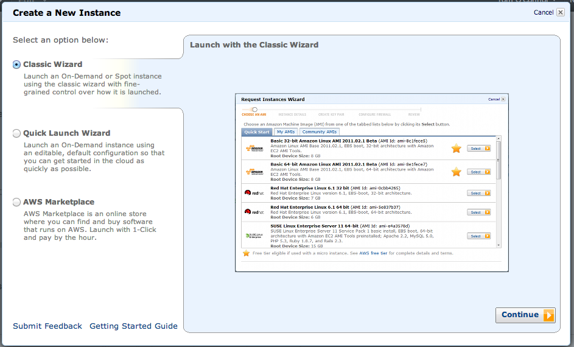
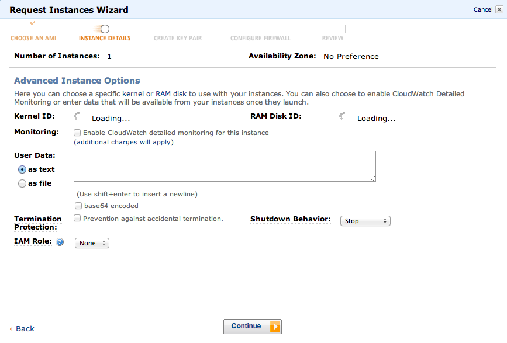
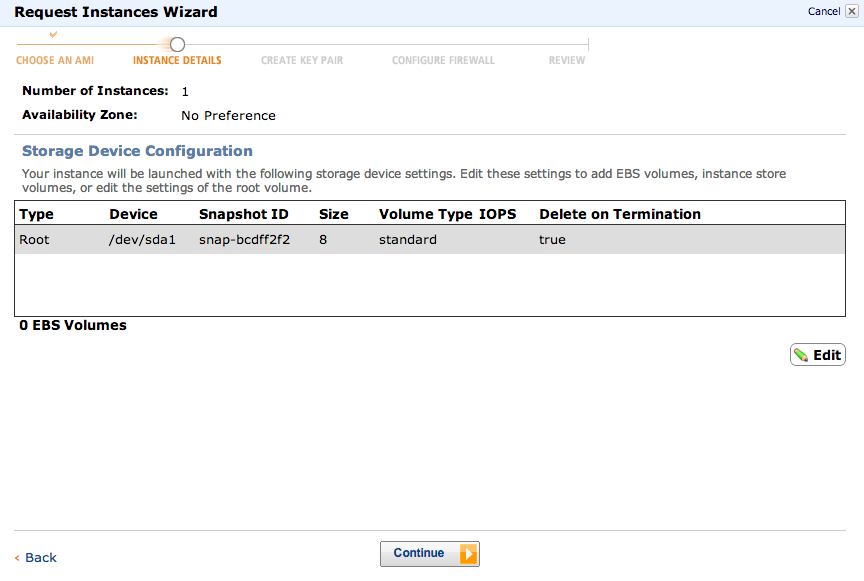
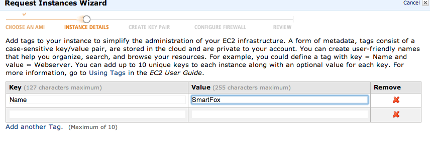
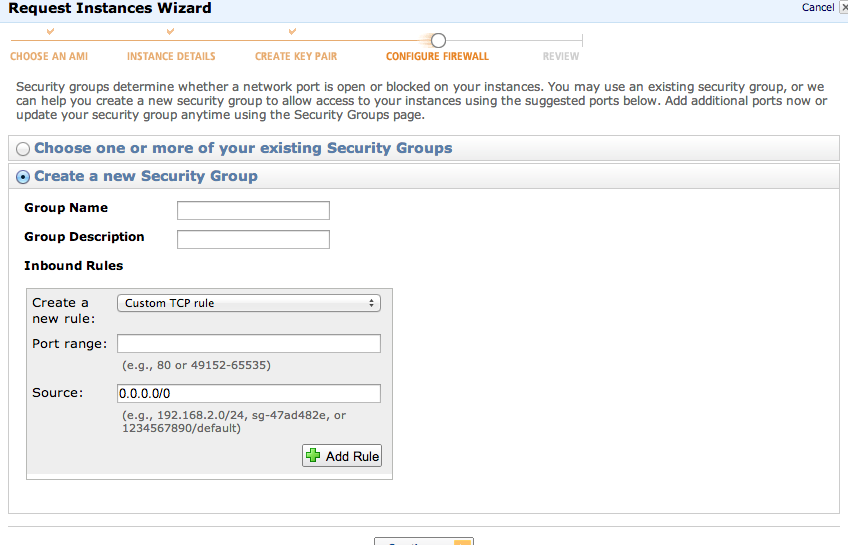
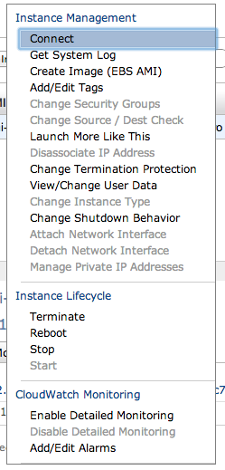

# Do not use any of the defaults shown below. I would no longer recommend a security group rule for port 22 to 0.0.0.0/0


This has been roughly adapted from [this ServerFault question](https://serverfault.com/a/479793/16732) for the case when it gets removed/deleted/closed.  

The question was about how to configure a Flash game server on Linux, but on EC2.  I had a good look around, but didn't find any true step-by-step EC2 tutorials for proper beginners.  So I made one.  This one is fairly specific to SmartFox Server towards the end, but the first few bits about creating an instance, and adding stuff to the security group should be generic enough to be useful.

## The Question
> I have made a ActionScript 3.0 Flash game and implemented multiplayer functionality using SmartFoxServer. Now I want to put this game on my website which is hosted on 000webhost.
> My game works absolutely fine on localhost. But I need to put my smartfox instance somewhere where it is publicly available. This is where I need you peoples help.
> There is an article explaining what needs to be done - hxxp://docs2x.smartfoxserver.com/GettingStarted/installation
> I do not understand, do I have to put my game and my smartfox instance on a remote server, vps, dedicated server or what?


## The Answer

Right.  You'll need to get a VPS, or at least an Amazon EC2 cloud instance to run this on. I'm 99.99% certain that you can't use the free package at 000webhost to do this.  They're a pure webhost, and you need somewhere you can configure and install Java, and the SmartFox server.

So.. Go to aws.amazon.com and sign up for a free account.

You'll need to provide them with a credit/debit card number, but they won't charge you as long as you keep within the free tier resource limits.

Once you've got an account, go [here](https://console.aws.amazon.com/console/home) and start an EC2 instance. 

This all assumes you know a bit about linux, but if you create your first instance using Ubuntu Linux 12.04 64-bit server, it'll make everything a bit easier!


When you click to create an instance you get this chooser:



Select a method to configure your instance

Select "Classic Wizard" and this AMI to boot.

Use this AMI (instance template)

Select the for this instance.. 


Accept these defaults

And the defaults on the next page too.


Select the default storage options. Storage options

And then name it. Name that sucker!

 

You now need to create a SSH key, and name that too.  When you click "Download Keypair" your browser will save the private key.  Keep this safe, because if you lose it, you've effectively lost the master key to your new server.

Get the key!

 

Now we need to create a security group.  This is the firewall of Amazon EC2.

Create a Security Group

 

Add inbound rules for SSH, HTTP and HTTPS.  This'll be enough for now. 

Inbound rules

Review the selections you've made.

Review

Hurrah! It should now be booting..

Booting

 

Time to get into it.  This is the control panel. 


Select your new server instance, and right click it and you get this menu.


 

Connect!

 

Then click Connect.

To access your instance:
```
Open an SSH client.
Locate your private key file (SmartFox.pem). The wizard automatically detects the key you used to launch the instance.
Your key file must not be publicly viewable for SSH to work. Use this command if needed: 
chmod 400 SmartFox.pem
Connect to your instance using its Public DNS. [ec2-xx-xx-xx-xx.compute-1.amazonaws.com].
Example
Enter the following command line:
ssh -i SmartFox.pem root@ec2-xx-xx-xx-xx.compute-1.amazonaws.com
```

Which is nearly right, except as it's an Ubuntu instance, you want to 

`ssh -i SmartFox.pem ubuntu@ec2-xx-xx-xx-xx.compute-1.amazonaws.com`

So, let's do that.

`ubuntu@ip-10-243-117-245:~$ `

And we're in.

Magic!

Gonna need the SmartFox installer next.. 

 

Download with wget, then tar xzvf and extract it. 
```
cd ~
wget hxxp://www.smartfoxserver.com/downloads/sfs2x/SFS2X_unix_2_0_1_64.tar.gz 
tar xzvf SFS2X_unix_2_0_1_64.tar.gz 
ls -lah
total 98544
drwxr-xr-x   4 tom  staff   136B 19 Feb 22:51 .
drwxr-xr-x  79 tom  staff   2.6K 19 Feb 22:41 ..
-rw-r--r--   1 tom  staff    48M 21 May  2012 SFS2X_unix_2_0_1_64.tar.gz
drwxr-xr-x   9 tom  staff   306B 13 Feb  2012 SmartFoxServer2X
⚡ SmartFoxServer2X ls -lah
total 160
drwxr-xr-x   9 tom  staff   306B 13 Feb  2012 .
drwxr-xr-x   4 tom  staff   136B 19 Feb 22:51 ..
drwxr-xr-x  15 tom  staff   510B 13 Feb  2012 .install4j
drwxr-xr-x   6 tom  staff   204B 13 Feb  2012 Client
-rwxr-xr-x   1 tom  staff    71K 13 Feb  2012 LicenseAgreement.pdf
-rwxr-xr-x   1 tom  staff   5.7K 13 Feb  2012 RELEASE-NOTES.html
drwxr-xr-x  13 tom  staff   442B 13 Feb  2012 SFS2X
drwxr-xr-x   8 tom  staff   272B 13 Feb  2012 jre
drwxr-xr-x   9 tom  staff   306B 13 Feb  2012 third-party-licenses
```

So, you can go ahead and start the damn thing now.

`ubuntu@ip-10-243-117-245:~/SmartFoxServer2X/SFS2X$ ./sfs2x-service start`

or with a full path, start it by running

`/home/ubuntu/SmartFoxServer2X/SFS2X/sfs2x-service start`

and stop it with:

`/home/ubuntu/SmartFoxServer2X/SFS2X/sfs2x-service stop`

You can perform the following commands on that sfs2x-service:` {start|stop|status|restart|force-reload}`

Interestingly enough, it looks like SmartFox needs port 8080 opening up on the AWS Security Group firewall.

```
ubuntu@ip-10-243-117-245:~/SmartFoxServer2X/SFS2X$ sudo netstat -anp |grep java
    tcp6       0      0 127.0.0.1:9933          :::*                    LISTEN      9142/java       
    tcp6       0      0 :::8080                 :::*                    LISTEN      9142/java       
    udp6       0      0 127.0.0.1:9933          :::*                                9142/java       
 
```
Luckily, that's really easy.
 
On the sidebar of the control panel, there's a Security Groups link.

Security Groups

 

Edit it, add a custom TCP rule and allow port 8080 to 0.0.0.0/0

Adding a custom rule

Add the rule, and **apply the changes**. 

You should now be able to reach your SmartFox game server on the DNS name given to you by Amazon EC2 in the control panel.  It's the same bit you SSH'd to earlier.

That's all folks!

## Update:
As I mentioned in bold at the top, this article doesn't represent best practices for AWS, and shouldn't be used.
