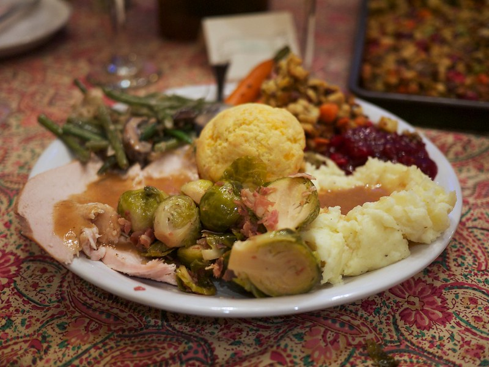

I think this seems like an appropriate time to say a few words in favour of the great United States of America.  There’s some things they just do excellently.  

Customer service springs to mind as one of the best I’ve ever encountered.  I’m not exactly sure why this is, but people do seem to be far more willing to be kind, courteous and helpful.

There’s other things too, the weather is, generally better (and if not better, then certainly more predictable).  There’s also the stunningly beautiful scenery.  I challenge anyone to gaze deeply at the Grand Canyon, or the [Yellowstone Paint Pots](https://www.flickr.com/photos/gulfcoastbeemer/5857005179/)  and not be stricken with a sense of awe and grandeur.  

I’d say that arguably, one of the finest American National Holidays (and gosh, aren’t there a lot?) is Thanksgiving.  It’s a celebration of everything you should be thankful for (and is excellent if you choose to forget about the origins of the holiday, which depending on who you listen to, are a bit worrying. 

However, most americans and their families and friends celebrate Thanksgiving with a feast.  This is one day of the year where you gorge yourself for a reason, as opposed to just gorging for no reason other than it’s there.

Thanksgiving in Britain is rarely celebrated, except for the expatriate community and its friends.  As a result, unless you’re doing the celebratory meal at your own home, you’re bound for disappointment.  

This is the very same disappointment I have suffered tonight at the Harvey Nichols 5th Floor Restaurant whose “Seasons” restaurant chose to put on a (quite expensive, all things considered) Thanksgiving 3 course meal. 

The general premise of a restaurant like this is to provide great food, at a reasonably expensive price to the cognoscenti of gastronomy.   Herein lies the problem.  For me, I’d be expecting some immense portions of still great food, but lots more of it than I’m going to find at this restaurant.

Odd restaurant.  Top floor of Harvey Nichols on Brompton Road.  Maybe 20-30 tables in a space of about 8 metres by 15 metres (at a guess).  Covered by a curved glass roof, which did little to improve the atmosphere, all it really did was amplify the cackle of the woman 4 tables across by an order of magnitude.  

Hard floors, hard walls and glass.  Very pretty.  Terrible for acoustic damping. 

First course.. Out of 14 of us, 12 (or so) chose the Sweetcorn, Bacon and Chicken soup.  On a plate the size of a truck wheel, the well was filled with about 15mm of soup.  All told, this was about 4 tablespoons, and a mouthful of bread for mopping. 

Paired wine was a fabulous Riesling, but again, there wasn’t enough of that either. Sadly. 

Second Course..  Turkey with Orange and Pistachio stuffing, Mash and Gravy.  

I don’t eat Pistachio nuts as they tend to make me unwell.  I told the waiter of this.  I expected to get a bit extra mash or turkey to compensate.  Did I buggery. 

This was someone elses, but just imagine it without the stuffing roll.

 

This is what I’ve come to expect a Thanksgiving dinner plate to look like... 

Seriously.  Where’s my fucking food? Where’s my goddamn cranberry sauce.  Where’s the mountain of mashed potato, and great lakes of gravy? Oh wait.  It’s not here.  Sorry.  I forgot where I was there.

Third Course.  Dessert. Options are Pumpkin Pie, or “Doughnut Funfair” -  Or something equally insanely named and utterly sickening.  I make it very clear to the waiter that I don’t eat chocolate, and he says that’s fine.  

My plate arrives.. about 10 minutes before everyone elses.  It contains 2 scoops of something white and unidentifiable, and something brown, and a wafer of something brown and sticky.  On further questioning, it transpires that “it's Vanilla, and Chocolate”.  Right.  What part of “I can’t eat chocolate, coffee or tea did you misunderstand?”.

The plate is withdrawn, and replaced several minutes later with 2 scoops of something white, and one scoop of something greenish.  Apparently this time it’s Vanilla and Pistachio.  

Really? 

Really?

Did you completely fail to grasp the “I can’t eat pistachio” from the earlier course, and still yet decide to insult me with something else in this, different course, which I still cannot eat. 

It’s at this time that I attempt to bring reason to the table with the suggestion that instead of bringing me things to look at, that I ask what there is instead, and whether I can just have a glass of wine or brandy instead? Apparently there’s Mango Sorbet.  Well, it’s not perfect.  But it’ll do.

Who the FUCK puts chocolate in a Pumpkin Pie anyway? Here’s some recipes for Pumpkin Pie.  None of them contain Chocolate, Cocoa, Coffee or anything equally inedible.

http://www.bbc.co.uk/food/recipes/pumpkinpie_70659

http://www.nigella.com/recipes/view/pumpkin-pie-253

http://www.jamieoliver.com/recipes/pastry-cake/pumpkin-pie

http://www.simplyrecipes.com/recipes/suzannes_old_fashioned_pumpkin_pie/

Interesting that.  Literally none of them contain chocolate.  Wonder why? That’s because Chocolate either wasn’t available in the 1600s, or they just don’t see the need to pollute a natural flavour with something so unpleasant as cocoa. 

So, three glasses of wine, all of which were gorgeous, although a bit short in supply.  I tend to think of a decent dinner containing 2-3 large glasses of wine per person.  Perhaps I’ve been dining abroad too much, but anyway.  

Five tablespoons of soup, at best. 

2 slices of turkey, a small dollop of mash (which may or may not have been chestnut mash), 6 green beans, a sole brussel sprout (cut into 5 sections), and maybe 3 tablespoons of gravy.  

3 scoops of Mango Sorbet (finally (!))

£45.00 a head.  

Plus 12.5% service charge, which frankly, wasn’t warranted.  The Dessert Debacle alone wiped the possibility of any service charge off the bill as far as I’m concerned.

 

Food: 6/10. 

Service: 2/10

Ambience: 2/10

 

Yeah. No.