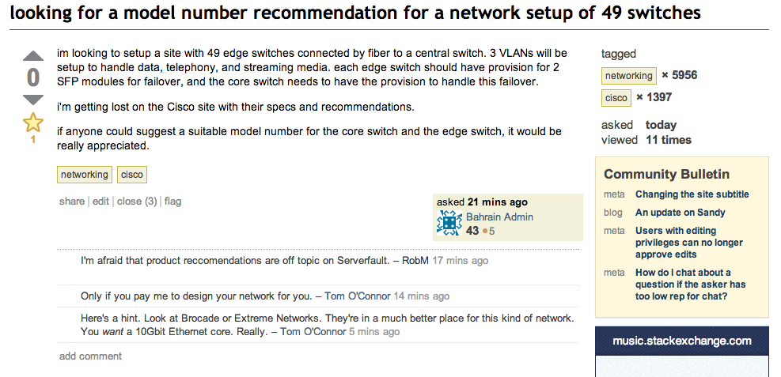
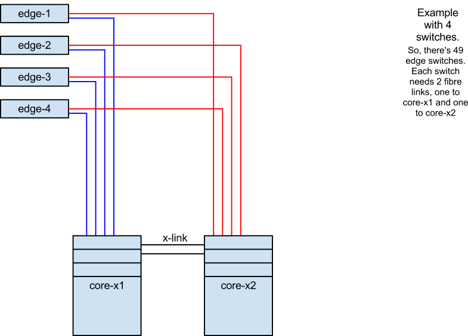

> I’m looking to setup a site with 49 edge switches connected by fiber to a central switch. 3 VLANs will be setup to handle data, telephony, and streaming media. each edge switch should have provision for 2 SFP modules for failover, and the core switch needs to have the provision to handle this failover.
> i'm getting lost on the Cisco site with their specs and recommendations.
> if anyone could suggest a suitable model number for the core switch and the edge switch, it would be really appreciated.”

This question amused me for a number of reasons, and I think it’s a bit of a shame it ended up closed Off Topic as it was written like a product recommendation.  

Let’s think about this in a little more detail.

Let’s make some assumptions based on what we know already.

The edge switches will be Gigabit Ethernet.  This is safe to assume because hardly anyone puts 10/100 switches into new builds, also the OP mentioned handling VoIP, Data, and Streaming Media.  The last one is the kicker.
The edge switches will be managed. If you wanna do VLANs, and QoS/CoS then a managed switch is a MUST.

The switching infrastructure will be High Availability.
This is the kind of thing I *love* doing, incidentally.

So, 49 switches.  Each switch needs 2 fibre uplinks, at 10Gbit (to handle the scale of the traffic).  That’s a total of 98 ports for a single switch, but we need 2 of them as the core needs to be HA.

Right.  There’s two options.

Stack some 48 port switches, so there’s 2x 48 port switches in stack A, and 2x 48 port switches in stack B.
Use a chassis switch with >49 ports per chassis.

In Scenario 1:

This is a bit of a bugger for two reasons. The first reason is that the 2nd member of the stack is hardly utilised, at the moment.  Of a possible 48 ports, you’re using 1 or 2.  On the other hand, you then can balance the edge interconnects across both members in the stack, if you choose, 24 on one, 25 on the other, or so.

The second reason is, that there’s a lot more cross-link cabling, you interlink the stack members with 2 stack cables, and then cross connect the stacked switches to each side of the core.

So let’s look at the alternate configuration

It’s pretty similar, except we’ve done away with the stack on either side of the core. Instead, we’ve gone for a chassis switch, which has more than 49 ports, and then means there’s less hardware to maintain, and there’s less crazy cabling too. Especially when you consider that many switches have proprietary stacking cables, which ain’t cheap.

So, there’s two ways to solve this problem.  The stack, and the chassis.

Let’s look at some hardware options, and indicative list pricing.

Firstly, The Stack (Scenario 1).

||||||
|--- |--- |--- |--- |--- |
|Qty|Desc|Model|Each|Total|
|4|Extreme Summit X670 stackable 10GB ethernet switches|Summit X670V-48x|$16,250|$65,000|
|4|VIM4-40G4X Stack Card|VIM4-40G4X|~$2000|$8,000|
|4|40GB QSFP+ Stack Cables|-|~$220|$880|
|4|Fan Modules|-|~$330|$1,320|
|49|Extreme Summit X350 48 port edge switch|Summit X350-48t|~$2000|$98,000|
|49|10Gbit Uplink Cards|XGM2-2SF|~$1300|$63,700|
|196|SFP Modules Short Range|-|$776.75|$152,096|
|OR|||||
|196|SFP Modules Long Range|-|$1296.75|$254,163|
||Total SR|||$388,996|
||Total LR|||$491,063|

Total Cost (excluding cabling), using Extreme Networks, List prices: $388,996 to $491,063.

The Chassis (Scenario 2):
||||||
|--- |--- |--- |--- |--- |
|Qty|Desc|Model|Each|Total|
|2|Black Diamond X8 Chassis|BDX8-AC|18,196.75|$36,339.50|
|4|PSU|BDX-PSU-AC2500|1,946.75|$7,787|
|4|Management Module|BDX-MM1|10,396.75|$41,587|
|4|48-port 10GBaseX SFP cards|BDXA-10G48X|20,146.75|$80,587|
|4|Fabric Module|BDXA-FM20T|19,496.75|$77,987|
|2|Core License|BDX-CORE-LIC|12,996.75|$25,993.50|
|4|Blanking panel|BDX-IO-BLANK|243.75|$975|
|-|Total||-|$271,310|
|49|Extreme Summit X350 48 port edge switch|Summit X350-48t|~$2000|$98,000|
|49|10Gbit Uplink Cards|XGM2-2SF|~$1300|$63,700|
|196|SFP Modules Short Range|-|$776.75|$152,096|
|OR|||||
|196|SFP Modules Long Range|-|$1296.75|$254,163|
||Total SR|||$585,106|
||Total LR|||$687,173|

Total Cost (excluding cabling), using Extreme Networks, List prices: $585,106 to $687,173

So my general gist from all of this is that a chassis switch is somewhat more expensive, but gives far more options for growth and expansion.  
All this was based on indicative list pricing of Extreme Networks gear (because I understand how that fits together).  
I suspect that Brocade, Cisco and Juniper, and Force10, and all those other switch hardware vendors would be pretty similarly priced.

Those prices also don't include the cost of the cabling, the power, the racks, the cooling, or many other things.  It also doesn't include my time in setting it all up.

I do enjoy shopping questions, and I'm always in two minds about answering them, regardless of the prices being out of date or inaccurate, because at the end of the day this is just a ballpark estimation figure, and you'd never ever pay the full list price.

If it was my network, I'd go for the Chassis switch at the core, there's so much more opportunity for further growth and expansion in the future.

So even if I'm not allowed to answer shopping questions on Serverfault, I'm inclined to make more of these type posts. 