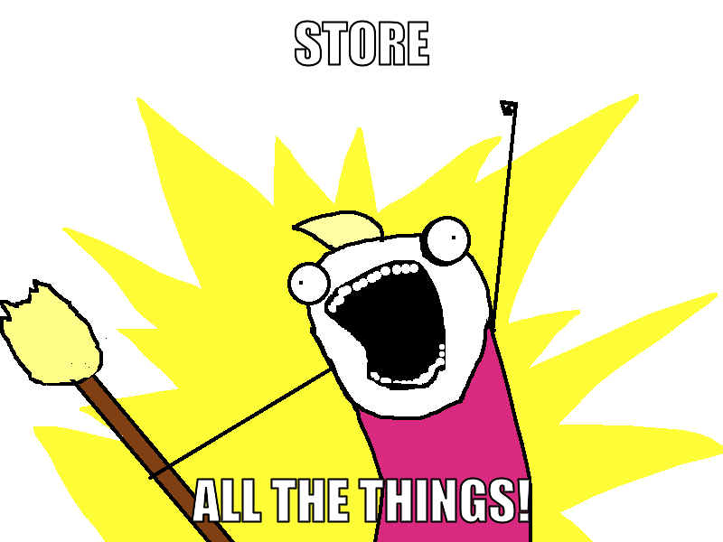

This is the brief story of how [PDFTribute.net](https://web.archive.org/web/20130116174844/http://pdftribute.net/) came to be, and survived being linked to from some of the top world news sites.

My good friend, Patrick Socha, so moved by the outpouring of data associated with the twitter hashtag `#pdftribute` set up a quick and dirty twitter archive, extracting tweets containing links.

I had a look at this, realised it looked awful on mobile (I was on a bus at the time!), and requested the source on Git.  

I built a really simple CSS design using Divshot (because I love bootstrap, love their CDN hosting, and I suck at designing anything by hand).

Patrick merged those changes in, and redeployed to his site hosted at pdftribute.psocha.co.uk (which now redirects to the main site)

We started talking about hosting somewhere a bit more capable for when we post to Hacker News, so I threw together a simple hosted instance on Appfog, deployed his code to there, whilst he was buying pdftribute.net.  Then it was a simple case of mapping the URL to appfog, and praying the DNS was quick to propagate (it was, being a new domain).

So at this point, we had the backend scraper, running on his VPS, writing data to a MongoDB instance at `mongohq.com`.  So there’s no massive need to worry about scaling Mongo, as we’re outsourcing that service to a company who do mongo scaling as their modus operandi. Isn’t “the cloud” awesome? 

The frontend reads from mongohq, and builds the page.  `Appfog` apps already have requests Varnished, so we didn’t need to find somewhere to put another server, running Varnish. Which is another great thing.  One less place things can go wrong.

The IP addresses that Appfog give you (to create A records for) point to an Elastic Load Balancer, and then when you scale up on the Appfog Control Panel, it adds instances behind the ELB, and deploys your code to them.

Before we posted to reddit, and news.yc, I scaled up the number of instances to 4, and created a pingdom account, so that I’d get instant SMS monitoring if the site goes down.

With the site now bootstrapped in CSS, *and* responsive, so it still looks awesome on mobile, and deployed to a 4-instance appfog cluster, we finally felt ready to get it out there.

In the first iteration on this setup, there was only really a “tweet this page” link, which tagged both @patricksocha and myself in the tweet text, so we had some idea of how many shares there’d been via twitter.

I set up tracking code on GoSquared, so we’d have some idea of how loaded our servers actually are, and how many people are actually on the site at any one time. -- This was actually crucial in deciding whether we scale up to more than 4 appfog instances.. In the end, when we had the highest traffic loading, we only had 5. 

In subsequent page versions, I added a “Like on Facebook” button, and accompanying Facebook Page, and then a Google +1 button (and why not?), and  re-released the site to appfog.  

It was immediately apparent that not only was the site trending on twitter, but also on facebook, and it wasn’t too long before we’d made the front page of Hacker News.  - This is a first for me.  

By 11AM on Monday, we’d also been linked to by the BBC, Huffington Post  and TechCrunch.  Over the course of the day, other news outlets picked up the story, and linked to us, so the waves of visitors followed the sun across the globe. 

At 2PM on Monday, we had 641 concurrent visitors to the site, the highest so far, and thousands of shares on twitter, retweets, shares and likes on facebook.  

By 13:30 on Tuesday, the site analytics told me that in total, since the site was launched, we’d served 131,852 page views, and there were still >150 visitors on the site, each spending on average >30 minutes browsing.  

Since then, we’ve been working on integrating our archive with others who’ve come forward (and some that I found on reddit, and Hacker News), to build an open-access repository of papers, with searching, indexing and analysis.  

At the Tomorrow’s Web meetup on Saturday 2nd of February, Patrick and I spoke about the challenges we've faced, and the process of building #PDFTribute.  

THE TAKE-HOME LESSONS ARE THESE: 
* Your idea doesn’t have to be awesome

We went a very long way on a very simple site, even when we were serving 10,000+ hits a day, the site was still pretty rough around the edges.  The deep-levels of interaction and clever design can come later, but having a very simple MVP (for want of a better word) early on is a valid enough starting point to give you a place to build out from in the future.

* A quick response time is crucial.  

Especially for virality and time-critical stuff..  If we’d waited a day before writing, or deploying the code, then we’d probably have missed all the fun. 

* Store *all* the things.  

One of the decisions made early on by Patrick was to store the majority of the important tweet data in the database.  We could hack together a deeper UI later on, but if we didn’t have the tweet data, that would be tricky (not impossible, but certainly less straightforward).  It’s much easier to store tweet data as one document per tweet than to try and break it down into a relational database (hence MongoDB as a natural choice).  Once you’ve got the data, what you do with it can come later.

* Cut the Crap.

It’s pretty clear from the design of PDFTribute that we went for a “no BS” appearance and implementation.  The important information is easy to access, and there’s no ads, no popups, and no “crap”.  It’d be very easy to fill the site out with visual “flare”, but that would invariably work against us.  

* Don’t underestimate the power of social media.  

This sounds obvious, living in the world of Twitter and Facebook and so on, but the majority of early adopter visitors we got, before the news outlets picked up the story were from Facebook Likes and Twitter, well, Tweets. When I first integrated the Facebook widget to the “Sharing is Caring” box on the PDFTribute page, I had to double check, because it was *already* showing 2.5k likes.  Turns out that we were already very well shared and liked on Facebook.  

* Outsourcing for fun and profit.  

 We scaled to 150k visitors in one day by having a very stable platform, powered by a number of outsourced services.  Hosted MongoDB, at MongoHQ, CSS and JS on the Divshot CDN, 4 backend webserver instances, already configured behind a load balancer, courtesy of Appfog’s Free Package.  Analytics via GoSquared. Monitoring and alerting was provided by Pingdom.  The only “files” hosted on Appfog are PHP, and there’s only 2 of those.

The advantage of this from my point of view is that I don’t have to remember how to make MongoDB scale, I don’t need to throw together 3 replica sets on different AWS Availability Zones.  I don’t need to write a single line of Puppet or Chef, because it’s all being provided to us, as a service, for free, ostensibly.  

The total cost of PDFTribute was £5.99 for the domain name.  

That’s the kind of lean agility that is needed to make sure that this kind of 3-day hack is successful. 

One of the brilliant things about the Appfog deployment process is that if you break all the things in the process, you still have 5 minutes of Varnish time, so that you have a chance to fix the site so that your visitors don’t see that you broke things, and you don’t lose traffic.

Finally, and perhaps most crucially:

* If you’re going viral, make sure you’ve the resources to do so.

I’ve written about this in the past, how some sites aren’t built for web-scale, and when they go viral, or have a traffic surge (due to advertising, or similar), they can’t cope with the sheer volume of visitors hitting the site at the time.  
Personally, I think it’s a little embarrassing, and always makes me doubt the “reliability” of the site that’s been brought down by the traffic resulting from a post on HackerNews, or Slashdot, or well, wherever.  

This was pretty much the driver for using Appfog in our case.  I wanted an easy-to-scale platform, with minimal effort.  As I mentioned in earlier points, there’s a lot to be gained for quick-and-easy scale from using SaaS/PaaS/IaaS providers to achieve this.  This gives you more time to focus on the code, rather than spending all evening figuring out how to set up 3 MongoDB servers, and a handful of EC2 instances, running NginX, PHP, FastCGI (or something), then putting the assets on S3/Cloudfront.  It’s a pretty obvious choice for agility and smoke-testing to try and be reliant on your own services as much as possible.

Going forward, PDFTribute is stable and still working.  It’s still hosted on Appfog, MongoHQ and Divshot’s CDN for the bootstrap bits.  

### Update:
PDFTribute.net survived until late 2016. 

 