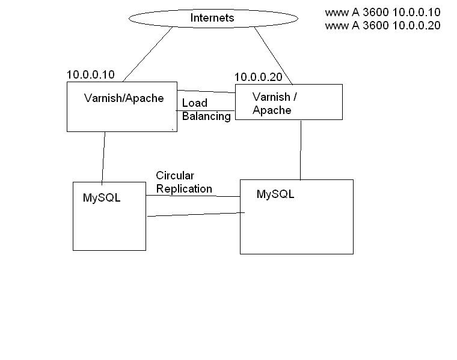

After answering [this question](https://serverfault.com/questions/218333/scalable-wordpress-host-for-high-volume-site/218360#218360), I reconsidered my answer a number of times, and I’ve finally decided to rewrite it as a longer version as a blog/essay on my website.  One of my fellow sysadmin types on Serverfault wrote an answer from a blog-post, and I intend to do the opposite.  
 
Right.
I see a lot of questions which are basically, “I want my blog/social network/niche site/new product launch site to handle a whole bunch of traffic, how do I do it?”.  

That’s pretty much what a lot of these questions boil down to, eventually.  
I’m going to make a few assumptions too.  
Given that someone’s taking the time to ask, I’ll assume that they’re actually concerned about uptime of the site.  For whatever reason, whether it’s because their employer is telling them that they must have 5 nines uptime or better, or the site’s actually making money for them.  Whatever the reason, we can generally accept that these websites are business oriented, and *should* have a reasonable budget assigned.
After having worked for a few different companies now, I can also fully accept that this second assumption might be a bit great, and not everyone has a good concept of how large, or encompassing the budget should be.

 
Let’s start at the bottom, with the really basic stuff.  
One server will be OK for a certain level of uptime, but at some point, you’ll near the sharp increase of the [bathtub curve](https://en.wikipedia.org/wiki/Bathtub_curve), and the probability that the hardware will fail goes up rapidly, and when it does, which it will, and if Murphy’s law is anything to go by, it’ll fail when you’re out of town, at a wedding, or in the pub.
It’s for this exact reason that as a Systems Engineer, I can’t count any lower than two.  What I mean by this, is that everything should come in pairs.  Two servers, containing >2 hard disks, 2 power supplies, and so on.  
So, let’s build a server, based on the above theories.  
Disks fail lots.  They’ve got moving parts.  So let’s concentrate on those.  If you’ve only got one disk, and it  fails, you’re screwed.  So let’s put 2 disks into this server.  
You’ve got a choice again between hardware and software RAID.  Linux software RAID is pretty good these days, but in some cases, hardware RAID is still preferable.  I’m a massive fan of 3ware and Adaptec cards.  Hardware RAID,  if you get a good card, is invaluable.  FakeRAID, as typically found on motherboards, or low-end raid cards is a bit of a ripoff.  It’s actually a form of software RAID, and utilises the main CPU.  On a hardware RAID card, the onboard CPU takes a massive load off from your main CPU, and is more efficient at processing nested RAID levels than the software RAID is, which uses the main CPU, which probably should be doing the really cool stuff that your server is designed for, not low-level stuff like disk processing.
There’s also something to be said for hardware RAID when it comes to non-linux operating systems.  I gather that hardware RAID on windows platforms is a lot more stable than software RAID on the same.
So, basically, if you value your sleep, and your uptime, then you’re going to need to protect yourself from these failures.

That’s disks out of the way for the time being, let’s talk about power.

Most good servers (and by good, I mean ones I’d consider in a high-availability infrastructure), have the capability of dual, or multiple power supplies.  These are brilliant, and protect against PSU failure, and power rail failure.  Be warned however; if you connect the PSUs to different phases, you’ll probably see a very pretty, yet expensive fireworks show, and possibly set off the fire detection systems in the datacenter.  Not a great idea.

In spite of the benefits of multiple PSU servers, they are more expensive, and to some extent, don’t offer a massive benefit, if the multiples are all plugged into the same power source, then you’re really only protecting against PSU failure.
The biggest problem I’ve seen in a datacenter, related to power, is the rack remote-hands unplugging or rebooting the wrong server.  As far as mitigating this goes, accidental unpluggings can be cut down with locking C13 cables , and remote-hands reboots can be avoided by using iLO/DRAC or an IP-PDU (Power Distribution Unit).

Whilst we’re on the topic of ancilliary rack hardware, things worth having:

IP-PDU (APC are very good)
IP-KVM (Raritan and Avocent both seem to be leaders in this market, Startech are ok but the interface is a bit clunky.)
IP-Serial Console (Raritan, Avocent, etc. )
 

I’ve rarely seen a 1U keyboard/monitor shelf in a rack.  There actually is little point, you’d be better off with a good Dell laptop, an USB->Serial cable, and perhaps stow a keyboard and monitor seperately in your rack somewhere.

Wow, I really digressed there.  Sorry about that.  Where was I?  Disks, Power, let’s look at the network.

Good servers have multiple NICs.  You need to design your network to make use of this.  Having one server/one NIC is good until your switch dies, or the NIC dies, or similar.  Then your server goes down, and people get shouty.
But again, a pair of NICs is no good if they’re only connected to a single switch.  Not only will it intensify any Spanning-Tree problems you may have, but it also provides no protection against switch failure.

So, a pair of switches.  Or similar multiples of two, thereof.  

Not only do you want a pair of switches on the network infrastructure, but you also want them to connect to a HA pair of firewalls, I quite like Cisco 55xx series, the 5510 and better offer good Active/Standby pairing, so switching between the two is simple, and they each monitor each other, and will share a virtual IP between them, with HSRP.

Next up, routing.  You’ll want a couple, if not more connections to the internets, for really nice stable connectivity.  I’ve argued this point over with a couple of colleagues, former and current.  When you’re relying on someone else for your network connectivity,  and you only have a single connection to their network, regardless of how diverse their network may be, you still only have a single connection, and that’s your biggest point of failure.  You can harden your servers as much as possible against device and part failure, and I still highly recommend that you do, but if you don’t have resilliency and redundancy at every level, then there’ll still be a single point of failure somewhere on your network.

It’s actually perfectly acceptable to have multiple IP Transits from different providers and provide different IP addresses.  As long as your application can cope with that.  

The ultimate solution however, requires having a couple of powerful routers at the edge of your network.  
These connect to a couple of transit providers and advertise your IP addresses over BGP.  You get a full internet routing table, and the rest of the internet sees the routes to your netblock.  The real bugger is though, that you’ve gotta have a reasonably large netblock to get noticed.  At the moment, this is a /24 or bigger.  That’s 255 IP addresses, and given the current rate of IPv4 depletion, getting justification for one of these is getting harder and harder.
Your carrier/transit provider can help you with the paperwork to get it all sorted out, though.  To stop the size of the full routing table becoming enormously massive, ISPs filter out netblocks smaller than a /24, so a certain amount of route aggregation takes place.  

Having BGP capable routers, and maintaining your own connections to the internet isn’t a walk in the park.  It’s a specialist task, and requires a skilled systems engineer to operate  and maintain it.  Not a task for the unprepared.
There are other advantages of course, if for example, you use the Akamai CDN lots, and you’re paying a lot for traffic to their network, then you may be able to enter into a peering agreement with them, where the traffic to their network is delivered cheaply, or for free, because it’s mutually beneficial for both parties in the agreement.  

So I think we’ve covered most of the major points on hardware and network resilliency and availability.  Let’s look at how to put that all together and build a hosting cluster.

For the purposes of brevity, and clarity, let’s assume for the time being that you’ve chosen to use a dedicated host provider. 
If you’re choosing to do the owned hardware / rented rack space thing, then there’s not a great deal of difference in the actual configuration of the servers, but there’s more complexity involved, etc.

For most small/medium size hosting needs, I tend to recommend a 4 node hosting cluster.  This is based on having 2 web servers, and 2 database backends.  
When you start off with a single webserver, with the database server on the same physical box, the fastest way to increase performance is to split and have 2 physical boxes, one for the webserver, one for the database.  The biggest problem with this is, that speed and scalability/redundancy/resilience tend to go hand in hand.   I personally don’t like single points of failure, so having a pair of everything has become something of a personal motto.  
**“I’m a systems engineer, I can’t count any lower than two”**

So if you’re concerned about uptime, then having a group of servers is a great thing.  

This is a rather quick and dirty sketch I knocked up in mspaint.  

I’ve been asked to provide the configuration information about this cluster, so I’ll copy that from my VM server later on.  I tend to use my powerful desktop to build test infrastructures quite a lot, so knocking up and provisioning 4 VMs is no massive stress.

A note now on configuration management.  

I have been in the position in the past where the “How to build a server” information is in a wiki page somewhere.  This is alright, but you do tend to end up with a difficult to document process.   

Instead, I prefer a combination of Preseeding and Puppet.   For no other reason than it’s what I prefer, we’ll be using Ubuntu 10.04 LTS in this article, although the processes for any other distribution aren’t too different.  When it comes to Puppet, both Debian/Ubuntu, and RHEL/Centos work well.  I haven’t tested Puppet with any other Distros, but I gather that it’s fairly well supported across the board.

Preseeding is the process of automating the steps of installing the operating system.  It’s basically an unattended installation process, that tells the installer what you would have selected, had you been in front of every machine whilst installing.  As you can no doubt imagine, when you’re building a farm of servers, preseeding is a massive bonus, and a timesaver.
Ubuntu, Debian, and Redhat-like distributions all have a mechanism for Preseeding a machine from bare metal.  I suspect that other distros do similar things, but I’ve never used them in a production environment.  Preseeding is a fairly broad topic, so I’ll cover that in a separate blogpost.

One of the things I adore about Puppet is the community contributed packages that are available at the touch of a button.  I’ve built a fairly comprehensive puppet infrastructure from a majority of contributed modules and packages.  I tend to just search Google for “puppet-” like puppet-apache and so on.
I, like many other sysadmins and systems engineers, am quite lazy, and have lately started to reap more benefits from the open-source puppet community.  You can pretty much build an entire infrastructure for a simple LAMP stack, based solely on other people’s puppet configs.

Puppet is lovely, it really is very easy to get going with, just start off with a server as your “puppetmaster”.  I’ve tended to go towards using Amazon EC2 micro instances for these, for small deployments.  When I’m working on my VM network, i just use my workstation.

I use bzr for my source control for puppet.  I like bzr, and it’s one of the best VCS tools i’ve used.  It doesn’t matter what you use, as long as you use something.  
But if you’re not using source control, then there’s bigger problems, and you need to rectify those first. Really.

Luckily, the vast majority of peoples contributed puppet modules and classes interoperate pretty well.  Once you’ve got a decent setup for the /etc/puppet directory, and configured the puppet configuration itself, then the next bit is really easy.

A very basic guide to setting up puppet can be found here: 
[Bitfield Consulting - Puppet](https://bitfieldconsulting.com/puppet-beginners-guide)

Software we’re going to use:

* Ubuntu 10.04 LTS
* Apache 2.2
* Varnish 2.1.4 (although, in this article, i’m using Pound, rather than Varnish, but I’ll detail Varnish in another blogpost)
* MySQL  5.2.something
* PHP 5.3.something
* Wordpress? I think WP will be OK, actually. 
* Memcache 1.4.5
 

All of it, nice free, open-source goodness.  We like open-source.

[This is the full working puppet config that I use](https://github.com/tomoconnor/puppet) .  It’s all pretty much gleaned from  other puppet-* repos on github, and a few other places.

So.. In theory, you should be able to checkout a copy of the above, and put it in /etc/puppet, and you should get a working puppetmaster, and be able to initialise 4 nodes.  

You will need to do some individual config, such as the loadbalancer setup, and adding vhosts for apache.  I’ve found that if you’re building biiiig farms, with lots of the same stuff, then adding the vhost config to the puppet manifest is a good thing to do, but for 2 servers, this kind of manual config is very easy to do by hand.

So that’s about it.  I think.  

I know I've digressed momentarily from the main stream of this evening’s symposium [extra points if you know where this is from], but I think it’s for the better.  There’s a lot of bits and bobs that I left out, and perhaps shouldn’t have, and some stuff I left in, that perhaps shouldn’t have been.  I’ve been meaning to write this up for a Very Long Time, and hope that it might be of some use to some of you, albeit under a somewhat bizarre set of circumstances [and this..].

 

I’ll  just recap briefly and say that when it comes to the server design for new projects, that a VPS server isn’t a total writeoff, but I have found in a number of instances that the IO performance is the biggest bottleneck on these virtualised systems.  
That isn’t to say that every new project and infrastructure desires a 4 node LAMP server system, not by a long way, but if you actually have the traffic and requirement, and also the budget to do it, then having dedicated servers (or colocated/owned servers), then you’ll probably find considerably better performance than you would with a VPS.

A final side-note on general price and suitability, and something that’s more relevant to the first part of this article.

All servers are not created equal.  A 1U server from HP, might set you back as little as £600, or as much as £2500.  On the other hand, you could build your own 1U servers from a 1U case, and off-the-shelf parts, but the build quality will be lower.

Combine that with the fact that you don’t get any kind of parts warranty to the same extend that you do with business grade hardware, and that consumer parts aren’t designed for a 100% duty cycle. 

It is possible to make a desktop machine into a server, and do everything on the cheap, but I highly recommend against it.  Things will fail, you won’t get warning, you won’t get warranty and it won’t be pretty.

If you’re making money from your infrastructure, or the systems that sit on it, then you’ve got some mechanism of getting the money back from the outlay of “doing it right”.  If you’re just building a lab environment, or playing with toy servers in your parents’ basement, then good luck to you, enjoy everything you do, but don’t host other people’s data on your toys.

High-availability isn’t something to look at lightly, it’s a pretty hardcore branch of systems engineering.  You’re playing with the big boys now, and you need to have invested a similar amount of money in your hardware as they have in theirs. 

Unless you’re Google, Facebook, or Twitter.  But you’re not.

