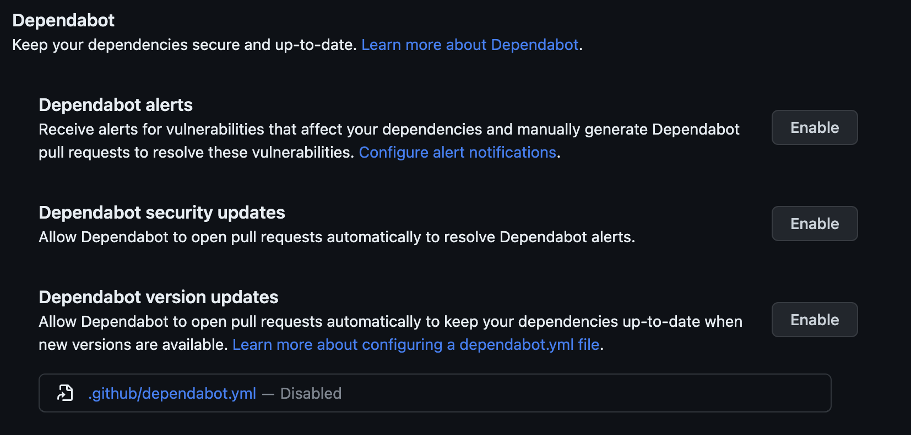
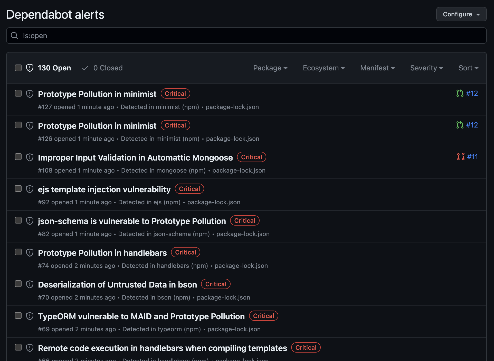

This is Part Two of the series "Introduction to DevSecOps".  In this segment, we're looking at integrating some tooling into the build and deployment pipelines. 

## Tooling

Looking more deeply into what's possible to action 'shift-left' security, it's time to start thinking about what tools we want to use, where we want to put them in the pipeline, and how to action the results. 

### Starting Point, a vulnerable app.

I forked https://github.com/snyk-labs/nodejs-goof into my github account.

That repo initially contained a bunch of snyk workflow github actions, which I have removed from my fork because I'm primarily planning to focus (in this article) on open-source tooling.

New Workflows we're adding:
1. Dependabot
2. Gitleaks

Dependabot
-----------

Dependabot is a tool that helps developers automate the process of updating dependencies in their software projects. 

It is particularly useful for managing open-source dependencies, as it can automatically create pull requests with updated versions of those dependencies when new versions are released. 

This helps ensure that a project is always using the latest and most secure versions of its dependencies, reducing the risk of security vulnerabilities and improving overall stability and performance.

Dependabot was initially an independent service, but it was acquired by GitHub in May 2019. Since the acquisition, GitHub has integrated Dependabot directly into its platform, providing the service as part of its suite of developer tools. 

Dependabot supports a wide range of programming languages and package managers, including JavaScript (npm and yarn), Ruby (Bundler), Python (pip), PHP (Composer), and many others.

### Enabling Dependabot

In Github Repo Settings:

I'm going to enable Dependabot security updates
 and Dependabot version updates

and the Dependency Graph in the settings block above it. 

We're now able to see Dependabot alerts under the [Security tab](https://github.com/tomoconnor/nodejs-goof/security/dependabot) of github

And gosh, aren't there a lot. 

Gitleaks
--------

Gitleaks is an open-source tool designed to scan Git repositories for sensitive information, such as passwords, API keys, tokens, and other secrets that should not be stored in the version control system.

The primary purpose of Gitleaks is to prevent potential security breaches and data leaks caused by the accidental or intentional exposure of sensitive information in Git repositories.

Gitleaks works by scanning the entire commit history of a Git repository, analyzing each commit and file for patterns that match pre-configured rules. 
These rules can be customized to fit the specific needs of a project, allowing developers to define their own set of sensitive data patterns that Gitleaks should detect.

By identifying sensitive data leaks early on, Gitleaks helps maintain the security of applications and the integrity of sensitive data.

Integrating Gitleaks
--------------------

This is easy.  Like many tools we're going to use in this article, Gitleaks is on the Github Actions marketplace.
https://github.com/marketplace/actions/gitleaks

So all we need to do is copy and modify the Usage Example to fit the workflow we want.

