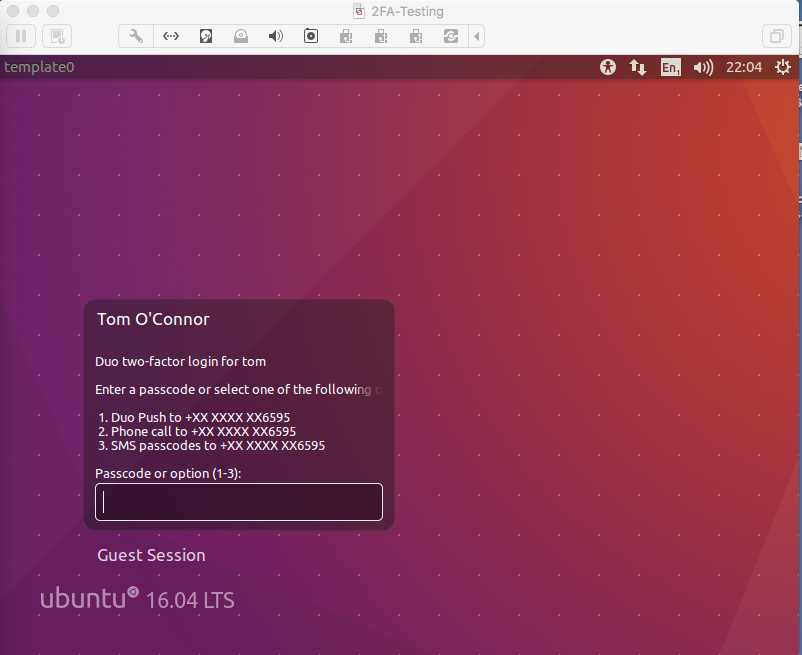

I've been playing with 2-factor authentication a lot lately, either commercially / within the enterprise with RSA SecurID, or at home, with a variety of services, such as Google Authenticator, Symantec VIP and most recently, Duo Security.

RSA SecurID is a bit of a pain to set up, but it does seem to work well in the enterprise.  It's too expensive to consider for home use, but for a VPN, it's pretty good.  

That said, there are other options available.

I was chatting recently with someone who's got an internet-accessible Raspberry Pi, and I suggested that 2-Factor Authentication would be a sweet way to add another layer of security, so I thought I'd have a go at Duo for SSH (it's basically a PAM module you compile and install).

I was playing with it on Ubuntu 16.04 Desktop on a VM, but it'll probably work on a Raspberry Pi - I'll try it when I get a chance.

This is all I had to do to get it working.  It's nice to find a product that actually has *working* documentation.

1. Sign up for an account on https://signup.duo.com/
2. Visit: https://duo.com/docs/duounix and follow the instructions.
3. Enjoy 2-factor Authentication for Linux.

On Ubuntu, the module gets installed into `/lib64/security`, so you have to give the full path when you reconfigure `pam.d/common-auth`.

In interactive SSH sessions, I see something like this when i log in.

In desktop sessions, this is what I get. 

On success:

On failure: 

It's that simple.  Now there's no excuse not to enable 2 Factor Authentication on your Linux workstations / servers.  

(Unless allowing traffic out over HTTPS to Duo is unacceptable or not possible)

In case you're curious, there are a whole bunch of other supported systems for Duo, including [Windows for RDP sessions and Local Logins](https://duo.com/docs/rdp)

A full list of supported platforms can be found on [this page](https://duo.com/docs)